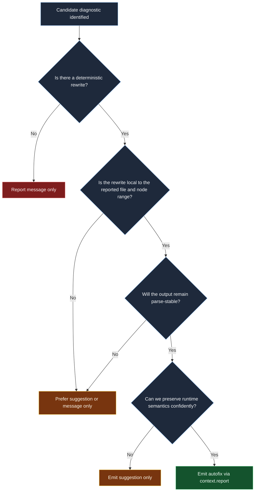

# Autofix safety decision tree

This chart explains how rule authors should decide whether a report gets a fix, a suggestion, or no rewrite at all.

## Why this chart matters

- Most fixes in this plugin should stay local and mechanical.
- Cross-file edits or import insertion are intentionally out of scope for the
  current codebase.
- Suggestion fallback is a correctness tool, not a failure mode.

## Review checklist

- Verify the rewrite only changes the code the rule can reason about.
- Verify the output stays syntactically valid after formatting.
- Verify a suggestion is used whenever runtime intent cannot be proven.
