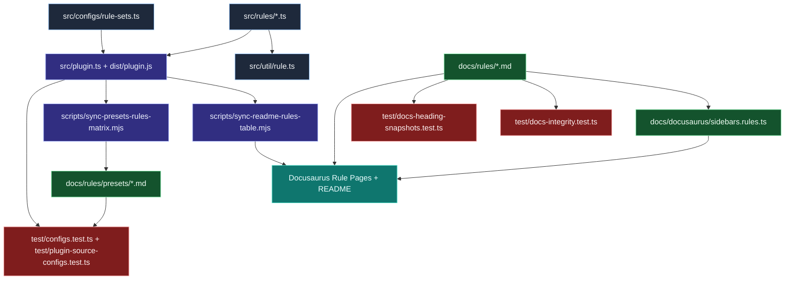

# Rule catalog and docs synchronization

Use this diagram to understand how a single rule change propagates through runtime metadata, hand-authored docs, generated tables, and validation tests.

## Why this matters

- Runtime metadata and docs URLs come directly from rule source.
- Sync scripts catch drift between preset membership and published tables.
- Docs tests keep hand-authored rule pages present and structurally consistent.

## Common maintenance workflow

1. Update rule logic and `meta.docs` fields in the rule source.
2. Update rule docs if examples/options changed.
3. Re-run README/preset sync scripts when preset or metadata surfaces change.
4. Run docs and preset validation tests before merging.
