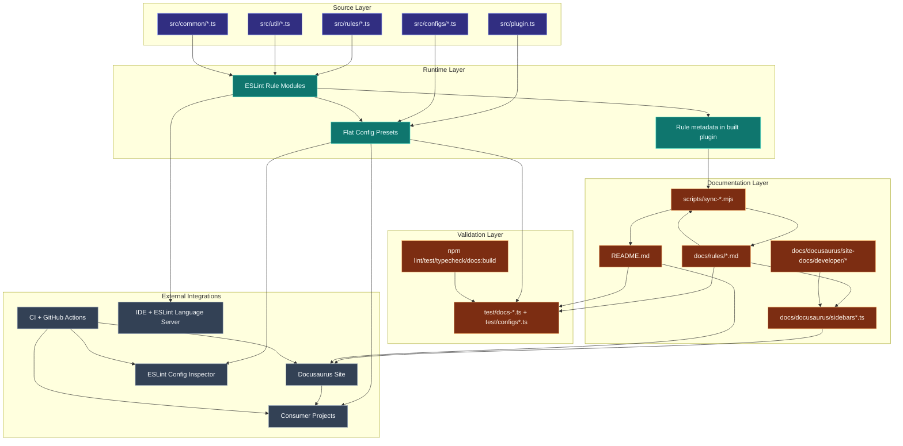

# System architecture overview

This diagram shows how source modules, preset wiring, docs sync scripts, and consumer integrations fit together.

## Notes

- `src/util/rule.ts` is the shared rule-authoring entry point for docs URL
  normalization and optional typed lookup.
- `src/configs/rule-sets.ts` is the canonical preset-membership source.
- Sync scripts regenerate README and preset matrix sections from the built
  plugin rather than from hand-maintained duplicate tables.

## How to read this diagram

- **Source layer** is where maintainers edit behavior and contracts.
- **Runtime layer** is what ESLint and consumers execute directly.
- **Documentation layer** controls generated/static docs discoverability.
- **External integrations** represent CI, IDE, and published artifact entry points.
